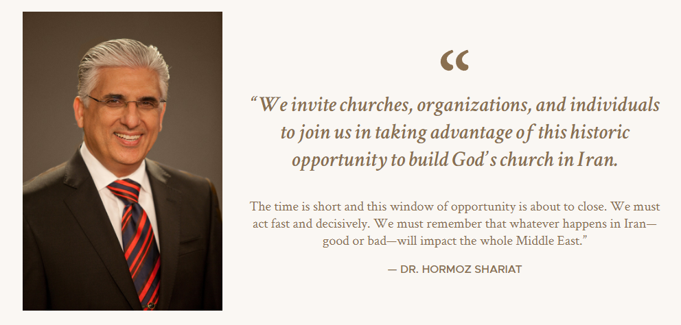
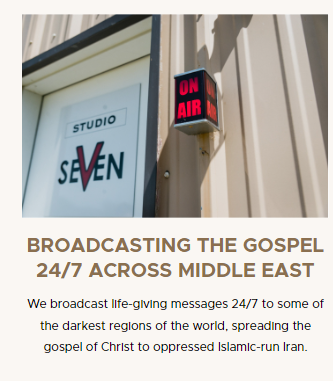
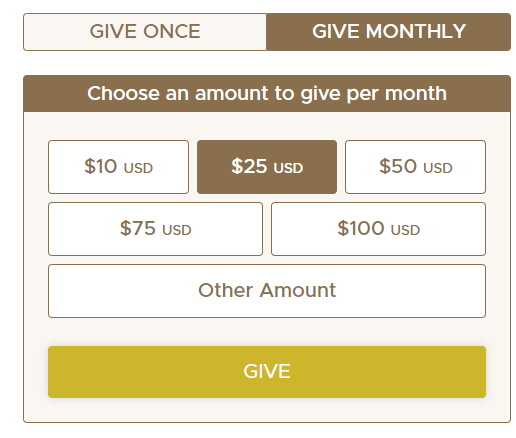
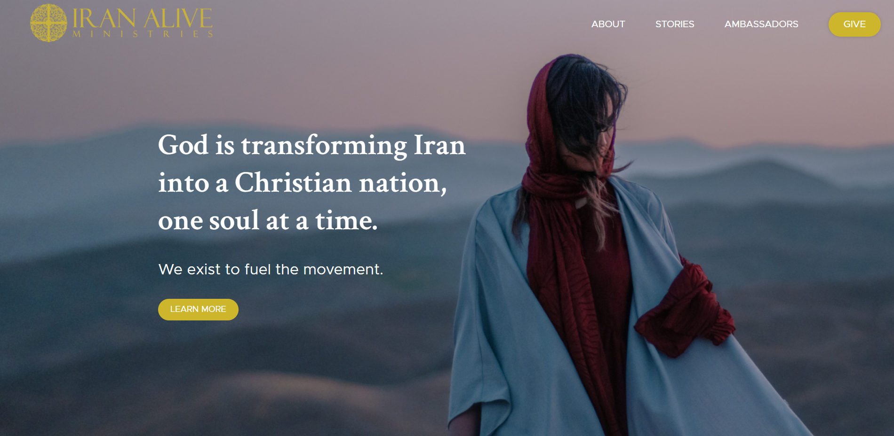
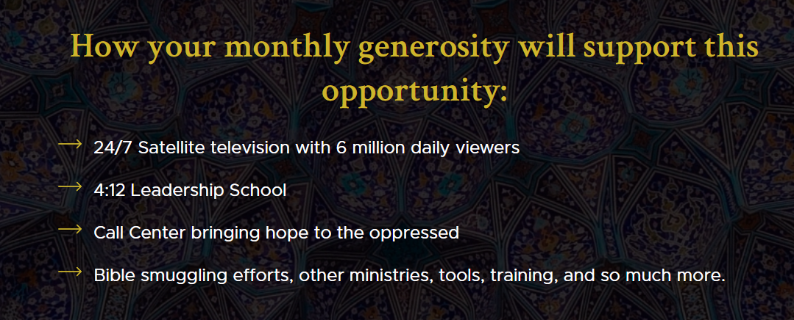
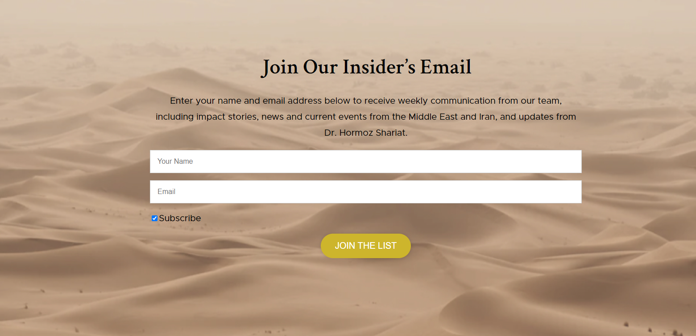
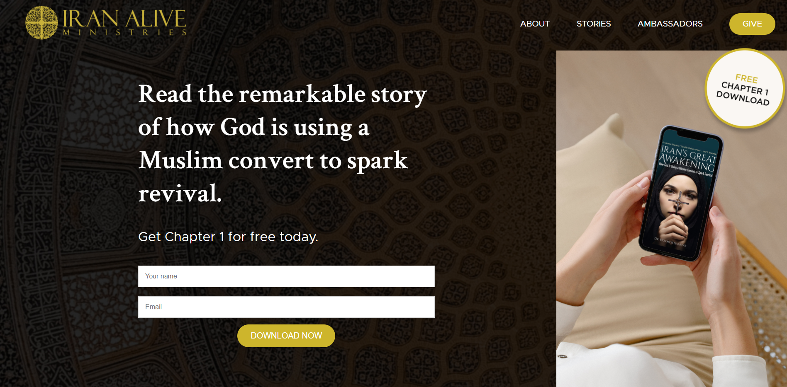
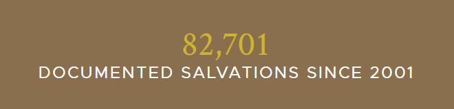

# Iran Alive Theme

This theme was created for IranAlive.org.

- [Theme Settings](#theme-settings)
  - [Colors](#colors)
  - [Typography](#typography)
  - [Font Sizes](#font-sizes)
- [Page Templates](#page-templates)
  - [Default Template](#default-template)
  - [Header Dark](#header-dark)
  - [No Nav](#no-nav)
- [Theme Blocks](#theme-blocks)
  - [Blockquote](#blockquote)
  - [Card](#card)
  - [Donate Form](#donate-form)
  - [Donation Tiers](#donation-tiers)
  - [Hero](#hero)
  - [List](#list)
  - [Section](#section)
  - [Side Image](#side-image)
  - [Statistic](#statistic)

## Theme Settings

### Colors

- Black (#000000)
- Gold (#CDB52C)
- Gray (#818181)
- Tan (#8A6F4F)
- Tan Light (#FAF7F3)
- White (#FFFFFF)

### Typography

- Crimson Text, serif
- Metropolis, sans-serif

### Font Sizes

- Small (14px)
- Normal (16px)
- Medium (20px)
- Large (24px)
- Extra Large (32px)
- 2XL (48px)
- 3XL (50px)
- 4XL (64px)

## Page Templates

### Default Template

- The default template will include a header that has light text
- This should be used when first section has a dark background.

### Header Dark

- This template will include a header that has dark text
- This should be used when the first section has a light background.

### No Nav

- This template will include a header without navigation.

## Theme Blocks

### Blockquote

This block is used to show a quote with attribution and even an image, if necessary.



| Option Name | Description                           |
|-------------|---------------------------------------|
| Image       | Image to be shown alongside the quote |
| Highlight   | The part of the quote to highlight    |
| Quote       | The rest of the quote                 |
| Citation    | Who to attribute the quote to         |

---

### Card

This block is used to display information in a card-like fashion with image, title and summary.



---

### Donate Form

This block populates a donate form from Salsa Labs.



| Option Name   | Description                                          |
|---------------|------------------------------------------------------|
| Form ID       | The ID of the form from Salsa Labs (ex: knlaBKTrPJ)  |
| Form Template | The form template from Salsa Labs  (ex: ```<div id="knlaBKTrPJ"><script type="text/javascript" src="https://default.salsalabs.org/api/widget/template/38cc5fcd-12b4-440d-b49b-2d0f0531b35b/?tId=knlaBKTrPJ" ></script></div>```) |

---

### Donation Tiers

This block is used to show a range of donation opportunities and what their impact could be.


| Option Name   | Description                          |
|---------------|--------------------------------------|
| Amount        | The amount of the donation tier      |
| Description   | The description of the donation tier |
| Content Color | The color of the text                |

---

### Hero

This block is used as an attention grabber at the beginning of the page and shows a full height/width image and content.



| Option Name             | Description                                                         |
|-------------------------|---------------------------------------------------------------------|
| Background Image        | Sets the background image of the hero                               | 
| Background Image Mobile | Sets the background image for mobile view if different from desktop |
| Background Video        | Sets the background video of the hero                               |
| Anchor Link             | Sets the jump/anchor link at the bottom of the hero                 |

---

### List

This block is used to create a stylized unordered list with arrows.

]

---

### Section

This is one of the most used blocks in this theme. This block allows you to add a container with a background color or image and to adjust the top and bottom padding. Other Iran Alive blocks and WordPress blocks can be used within the Section block.



| Option Name      | Description                                                                |
|------------------|----------------------------------------------------------------------------|
| Background Color | Sets the background color of the section ([See colors](#colors))           |
| Background Image | Sets the background image of the section                                   |
| Padding          | Sets the top and bottom padding of the section (None, Small, Medium Large) |

---

### Side Image

This component is used to show a hero section with another image to the side.



| Option Name             | Description                                                      |
|-------------------------|------------------------------------------------------------------|
| Background Image        | The background image of the hero                                 |
| Background Image Mobile | The background image to show on mobile if different from desktop |
| Background Video        | The background video of the hero                                 |
| Anchor Link             | Sets the jump/anchor link at the bottom of the hero              |
| Side Image              | The image to show on the right-side of the hero on desktop       |

---

### Statistic

This block is used to display a statistic that counts up from 0.



| Option Name | Description                |
|-------------|----------------------------|
| Number      | Number to count up to      |
| Description | The text to be shown below |